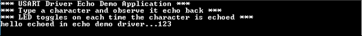

# USART driver synchronous - USART echo

This example echoes the received characters over the console using the USART driver in synchronous mode in Mbed OS RTOS environment.

## Description

This example uses the USART driver in synchronous mode in Mbed OS RTOS environment to communicate over the console. It receives and echo's back the characters entered by the user.

## Downloading and building the application

To clone or download these applications from Github, go to the [main page of this repository](https://github.com/Microchip-MPLAB-Harmony/mbed_os_rtos_apps) and then click **Clone** button to clone this repository or download as zip file. This content can also be downloaded using content manager by following these [instructions](https://github.com/Microchip-MPLAB-Harmony/contentmanager/wiki)

Path of the application within the repository is **apps/driver/usart/sync/usart_echo/firmware/**

To build the application, refer to the following table and open the project using its IDE.

| Project Name      | Description                                    |
| ----------------- | ---------------------------------------------- |
| sam_d21_xpro.X    | MPLABX Project for [SAM D21 Xplained Pro Evaluation Kit](https://www.microchip.com/developmenttools/ProductDetails/atsamd21-xpro) |
| sam_e54_xpro.X    | MPLABX project for [SAM E54 Xplained Pro Evaluation Kit](https://www.microchip.com/developmenttools/ProductDetails/atsame54-xpro) |
| sam_e70_xult.X    | MPLABX project for [SAM E70 Xplained Ultra Evaluation Kit](https://www.microchip.com/DevelopmentTools/ProductDetails/PartNO/DM320113) |
|||

## Setting up the hardware

The following table shows the target hardware for the application projects.

| Project Name| Board|
|:---------|:---------:|
| sam_d21_xpro.X | [SAM D21 Xplained Pro Evaluation Kit](https://www.microchip.com/developmenttools/ProductDetails/atsamd21-xpro) |
| sam_e54_xpro.X | [SAM E54 Xplained Pro Evaluation Kit](https://www.microchip.com/developmenttools/ProductDetails/atsame54-xpro) |
| sam_e70_xult.X | [SAM E70 Xplained Ultra Evaluation Kit](https://www.microchip.com/DevelopmentTools/ProductDetails/PartNO/DM320113) |
|||

### Setting up [SAM D21 Xplained Pro Evaluation Kit](https://www.microchip.com/developmenttools/ProductDetails/atsamd21-xpro)

- Connect the Debug USB port on the board to the computer using a micro USB cable

### Setting up [SAM E54 Xplained Pro Evaluation Kit](https://www.microchip.com/developmenttools/ProductDetails/atsame54-xpro)

- Connect the Debug USB port on the board to the computer using a micro USB cable

### Setting up [SAM E70 Xplained Ultra Evaluation Kit](https://www.microchip.com/DevelopmentTools/ProductDetails/PartNO/DM320113)

- Connect the Debug USB port on the board to the computer using a micro USB cable

## Running the Application

1. Open the Terminal application (Ex.:Tera term) on the computer.
2. Connect to the EDBG Virtual COM port and configure the serial settings as follows:
    - Baud : 115200
    - Data : 8 Bits
    - Parity : None
    - Stop : 1 Bit
    - Flow Control : None
3. Build and program the application using its IDE
4. Type a character and observe the output on the console as shown below:

    

5. LED toggles each time the character is echoed

Refer to the following table for LED name:  

| Board | LED Name |
| ----- | -------- |
| [SAM D21 Xplained Pro Evaluation Kit](https://www.microchip.com/developmenttools/ProductDetails/atsamd21-xpro) | LED0 |
| [SAM E54 Xplained Pro Evaluation Kit](https://www.microchip.com/developmenttools/ProductDetails/atsame54-xpro) | LED0 |
| [SAM E70 Xplained Ultra Evaluation Kit](https://www.microchip.com/DevelopmentTools/ProductDetails/PartNO/DM320113) | LED1 |
|||
